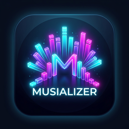

# Musializer-RS

<p align="center">
  
</p>

<p align="center">
  <strong>High-Performance, Real-Time Audio Visualizer</strong><br>
  Built with <strong>Rust</strong>, <strong>egui</strong> (Desktop), and <strong>Flutter</strong> (Mobile).
</p>

---

## 🏛️ Project Architecture (Multi-Crate Workspace)

```
musializer-rs/
├── Cargo.toml                    # Root workspace manifest
├── build-mobile.sh               # 1-command release APK build script
│
├── crates/
│   ├── musializer-core/          # Pure Rust DSP, FFT math, Symphonia audio decoding
│   │   ├── src/
│   │   │   ├── api.rs            # flutter_rust_bridge zero-copy interface
│   │   │   ├── audio/            # Decoder (symphonia), Player (cpal), Sync
│   │   │   ├── dsp/              # rustfft, Hann window, EMA smoother, log bands
│   │   │   └── engine.rs         # Unified AudioVisualizerEngine
│   │   ├── build-android.sh      # Android NDK build automation
│   │   └── build-ios.sh          # iOS build automation
│   │
│   └── musializer-desktop/       # Existing high-performance egui / eframe desktop application
│       └── src/
│           ├── main.rs           # Desktop entry point
│           ├── app.rs            # Desktop state loop
│           ├── ui/               # egui controls, visualizer, themes
│           ├── export/           # Video renderer & ffmpeg pipe
│           └── updater/          # In-app GitHub release updater
│
└── mobile/                       # High-performance 120 FPS Flutter mobile app (Android & iOS)
    ├── lib/
    │   ├── main.dart             # Mobile app entry point
    │   ├── models/               # Visualizer modes & color themes
    │   ├── painters/             # 120 FPS CustomPainter visualizers (Bars, Radial, Waveform)
    │   ├── state/                # VisualizerController & real-time ticker
    │   └── widgets/              # Header, mode switcher, seek timeline, volume & gain
    ├── android/                  # Android Gradle build & permissions
    └── ios/                      # iOS Runner & Audio Background capabilities
```

---

## 🖥️ Running & Building the Desktop App

The desktop application is built with pure Rust, egui, and wgpu.

### Run Desktop App:
```bash
cargo run --bin musializer-rs
```

### Build Desktop Release Binary:
```bash
cargo build --release --package musializer-desktop
```

---

## 📱 Running & Building the Mobile App (Android & iOS)

The mobile UI is built with **Flutter** and powered by `musializer-core` via **`flutter_rust_bridge`** for 120 FPS zero-copy audio rendering.

### Prerequisites:
- **Rust** & targets:
  ```bash
  rustup target add aarch64-linux-android armv7-linux-androideabi x86_64-linux-android
  # For iOS (on macOS):
  # rustup target add aarch64-apple-ios aarch64-apple-ios-sim x86_64-apple-ios
  ```
- **Cargo Tools**: `cargo install cargo-ndk flutter_rust_bridge_codegen`
- **Flutter SDK**: `3.7.0+`

### 1-Command Android Release Build:
```bash
./build-mobile.sh
```

### Run on Android Device / Emulator:
```bash
# 1. Compile Rust core libraries for Android:
(cd crates/musializer-core && ./build-android.sh)

# 2. Run Flutter app:
cd mobile
flutter run
```

### Run on iOS (macOS / Xcode):
```bash
# 1. Compile Rust core for iOS:
(cd crates/musializer-core && ./build-ios.sh)

# 2. Run Flutter iOS app:
cd mobile
flutter run -d ios
```

---

## 🧪 Testing & Verification

Run the entire test suite across all workspace crates and the mobile app:

```bash
# Rust Workspace Unit Tests (DSP, decoding, audio sync)
cargo test --workspace

# Flutter Mobile Unit & Widget Tests
cd mobile && flutter test && flutter analyze
```

---

## 📄 License
This project is licensed under the GPL-3.0-or-later License.
