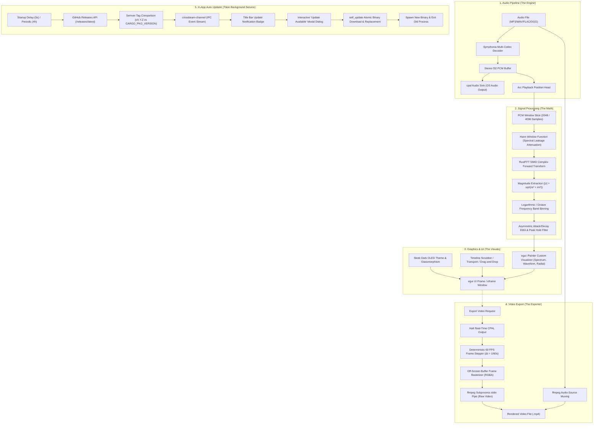

# Architecture Documentation: Musializer-RS

Musializer-RS is a high-performance, cross-platform audio visualizer written in Rust, inspired by `tsoding/musializer`. It combines native audio decoding and playback, real-time Fourier analysis (DSP), hardware-accelerated GPU rendering, and deterministic offline video rendering with FFmpeg.

---

## High-Level Architecture Overview



---

## 1. Audio Pipeline (The Engine)

The Audio Pipeline handles format decoding, buffered audio storage, real-time playback via the OS sound system, and frame-accurate playback position synchronization.

### 1.1 Multi-Format Decoding (`src/audio/decoder.rs`)
- **Library**: `symphonia` with support for MP3, WAV, FLAC, OGG/Vorbis, and AAC.
- **Conversion**: All incoming audio is decoded and converted into normalized 32-bit floating-point interleaved stereo samples `[-1.0, 1.0]`.
- **Track Model**:
  ```rust
  pub struct AudioTrack {
      pub samples: Vec<f32>,       // Interleaved stereo samples
      pub sample_rate: u32,        // e.g., 44100 or 48000 Hz
      pub channels: u16,           // 1 (mono) or 2 (stereo)
      pub total_samples: usize,
      pub duration_seconds: f32,
      pub file_path: PathBuf,
  }
  ```

### 1.2 Real-Time Audio Output Sink (`src/audio/player.rs`)
- **Library**: `cpal` (Cross-Platform Audio Library).
- **Behavior**: Opens the OS default output device with a dedicated real-time audio callback thread.
- **Features**: Real-time play/pause toggle, linear seeking, volume scaling, and seamless track looping or finish notifications.

### 1.3 Synchronization Primitive (`src/audio/sync.rs`)
- **Position Tracking**: Uses an `Arc<AtomicUsize>` holding the exact index of the current playback sample frame.
- **Visualizer Sync**: The render thread samples `current_index` and slices a window of PCM samples centered around the playback head, ensuring visual animations match audible sound.

---

## 2. Signal Processing (The Math)

The DSP module converts raw temporal audio waveforms into human-perceptible, dynamic frequency data.

### 2.1 Windowing Function (`src/dsp/window.rs`)
- **Algorithm**: Pre-computed **Hann (Hanning) Window** applied to input sample blocks (typically $N = 2048$ or $N = 4096$):
  $$w(n) = 0.5 \left(1 - \cos\left(\frac{2\pi n}{N - 1}\right)\right), \quad 0 \le n < N$$
- **Purpose**: Smooths boundary discontinuities at window edges, preventing spectral leakage and artificial high-frequency noise.

### 2.2 Fast Fourier Transform (`src/dsp/fft.rs`)
- **Library**: `rustfft` using hardware SIMD acceleration (AVX/SSE/NEON).
- **Computation**: Executes forward complex FFT on windowed samples $x[n] \to X[k]$:
  $$\text{Magnitude}[k] = \sqrt{\text{Re}(X[k])^2 + \text{Im}(X[k])^2}$$

### 2.3 Frequency Band Binning & Dynamic Range Compression (`src/dsp/frequency.rs`)
- **Logarithmic Mapping**: Human hearing perceives pitch logarithmically. The linear FFT bins are clustered into $M$ visual frequency bands (e.g. 64 to 128 bars) spaced exponentially between $f_{\text{min}} = 20\text{ Hz}$ and $f_{\text{max}} = 20{,}000\text{ Hz}$.
- **Dynamic Range Compression**: For quiet audio passages or low-energy recordings, raw magnitudes are compressed using power-law non-linear scaling:
  $$y = (4.0 \cdot x \cdot \text{gain} \cdot \text{boost}_{\text{treble}})^{0.55}$$
  This expands subtle acoustic details and lifts quiet intro passages while gracefully compressing loud transients to prevent clipping.
- **Visual Sensitivity Boost**: Adjustable runtime gain factor ($\text{gain} \in [0.5, 3.5]$) accessible from the UI transport bar.

### 2.4 Temporal Dynamics & Smoothing (`src/dsp/ema.rs`)
- **Algorithm**: Dual-rate Exponential Moving Average (EMA) with peak hold:
  - **Attack ($\alpha_{\text{attack}} \approx 0.85$)**: Instant response to loud transient beats.
  - **Decay ($\alpha_{\text{decay}} \approx 0.15$)**: Smooth, graceful gravity falloff to prevent visual flickering.
  - **Peak Hold**: Floating top cap dots with configurable gravity falloff.

---

## 3. Graphics & Visualizer Engine

### 3.1 Visualizer Modes
- **Spectrum Bars**: Frequency bars with reactive heights, multi-color gradient palettes, and floating peak hold dots.
- **Oscilloscope Waveform**: Continuous smooth antialiased waveform line with dynamic scaling.
- **Circular Pulse**: Radial frequency burst with bass pulse and a customizable center hub:
  - **Custom Cover Art / Album Art**: Displays user-selected image or embedded application logo.
  - **Time Elapsed**: Displays live timestamp (e.g., `01:45 / 03:30`) with glowing typography.
  - **Time Remaining**: Displays countdown timestamp (e.g., `-01:45 REMAINING`).
  - **Track Title**: Displays formatted track title and live timestamp.

---

## 3. Graphics & UI (The Visuals)

Built with `egui` and `eframe`, utilizing hardware-accelerated WGPU graphics.

### 3.1 Styling & Design System (`src/ui/theme.rs`)
- Modern dark-mode palette: Deep slate/charcoal backgrounds (`#0B0D13`), soft borders, rounded corners (8–12px radius), and glowing accent gradients (electric violet, neon cyan, radiant amber).
- High visual hierarchy: Minimalist, clean controls that keep the visualizer front and center.

### 3.2 Custom Painters (`src/ui/visualizer.rs`)
- **Spectrum Bars**: Dynamic vertical gradient bars with rounded caps and floating peak indicators.
- **Waveform Oscilloscope**: Antialiased polyline showing stereo/mono temporal waveforms.
- **Circular/Radial Mode**: Radial frequency bars radiating outward from a pulsing core that responds to bass energy.

### 3.3 Control Surface (`src/ui/controls.rs`, `src/ui/drag_drop.rs`)
- Full drag-and-drop zone overlay for loading audio files instantly.
- Transport bar with Play/Pause, Seek bar with elapsed/total time, volume slider, visualizer mode switcher, and "Export Video" modal trigger.

---

## 4. Video Export (The Exporter)

Renders high-definition visualizer animations into standalone MP4 video files with synchronous audio.

### 4.1 Deterministic Offline Frame Stepper (`src/export/stepper.rs`)
- Halts real-time `cpal` audio output during export.
- Steps through the audio file in exact mathematical frame increments:
  $$\Delta \text{samples} = \frac{\text{sample\_rate}}{\text{fps}} = \frac{48000}{60} = 800\text{ samples/frame}$$
- Guarantees 0% dropped frames and perfect audio/video synchronization regardless of machine render speed.

### 4.2 Off-Screen Frame Buffer Rasterization (`src/export/renderer.rs`)
- Renders visualizer frames directly to an in-memory 32-bit RGBA pixel buffer at standard resolutions (1080p, 720p).

### 4.3 FFmpeg Subprocess Pipeline (`src/export/ffmpeg.rs`)
- Checks for system `ffmpeg` installation via `std::process::Command`.
- Spawns `ffmpeg` child process and pipes raw RGBA frames directly to `stdin`:
  ```bash
  ffmpeg -y -f rawvideo -vcodec rawvideo -s 1920x1080 -pix_fmt rgba -r 60 -i - -i <input_audio> -c:v libx264 -pix_fmt yuv420p -c:a aac -shortest <output.mp4>
  ```
- Non-blocking background thread with progress reporting and cancellation support.

---

## 5. In-App Automated Update Subsystem

The In-App Automated Updater provides zero-friction version discovery, changelog inspection, and one-click in-place binary upgrades.

### 5.1 Asynchronous Background Service (`src/updater/service.rs`)
- **Runtime**: Dedicated `tokio` multi-threaded worker runtime separate from the GUI thread.
- **Poll Cadence**: Performs an initial check 5 seconds after application startup to avoid contention during cold boot, then checks periodically every 4 hours.
- **GitHub Releases REST API**:
  - Endpoint: `https://api.github.com/repos/gabinroy/musializer-rs/releases/latest`
  - Uses `reqwest` with `rustls-tls` to avoid system OpenSSL dependencies.
  - Compares the remote tag (`release.tag_name`) against the local compile-time version (`env!("CARGO_PKG_VERSION")`) via `semver::Version`.

### 5.2 Thread-Safe Inter-Process Communication (`src/updater/types.rs`)
- **Channel Layer**: Lock-free unbounded `crossbeam-channel` queues (`cmd_tx`/`cmd_rx` and `event_tx`/`event_rx`).
- **Zero UI Stalls**: The UI thread drains incoming events with `try_recv()` at the start of each frame without blocking audio visualization rendering.

### 5.3 UI Components (`src/ui/title_bar.rs`, `src/ui/update_modal.rs`)
- **Title Bar Notification Badge**: When `UpdateStatus::UpdateAvailable` is active, displays an eye-catching cyan pill badge (`⚡ Update vX.Y.Z`).
- **Interactive Modal Dialog**:
  - Displays side-by-side Current vs. Latest version tags.
  - Markdown-rendered changelog scroll area.
  - "Remind Me Later" and "⚡ Update Now" action buttons.
  - Real-time download progress bar and spinner.
  - Graceful error display with retry options.

### 5.4 Cross-Platform Binary Replacement & Process Restart
- **Library**: `self_update` with target platform archive matching.
- **Atomic Replacement**:
  - **Linux / macOS**: Replaces the binary atomically using file system inode replacement / `rename` (safe even while the current process is running).
  - **Windows**: Handles locked executable files by renaming the current executable to `.old` and writing the new binary in place.
- **Auto-Restart**: Spawns a fresh child process via `std::process::Command::new(std::env::current_exe()?).spawn()` and cleanly terminates the old process with `std::process::exit(0)`.
