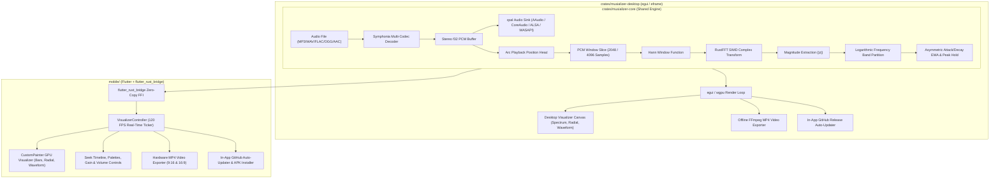

# Architecture Documentation: Musializer-RS (Workspace & Multi-Platform)

Musializer-RS is a high-performance, cross-platform audio visualizer written in Rust and Flutter. It is structured as a modular Cargo Workspace with a pure Rust core engine (`musializer-core`), a native desktop UI (`musializer-desktop`), and a GPU-accelerated mobile app (`mobile`).

---

## High-Level Architecture Overview



---

## 1. Workspace Organization

```
musializer-rs/
├── Cargo.toml                          # Workspace root manifest
├── build-mobile.sh                     # 1-command release APK build script
│
├── crates/
│   ├── musializer-core/                # Shared audio & DSP brain
│   │   ├── src/
│   │   │   ├── api.rs                  # flutter_rust_bridge zero-copy interface
│   │   │   ├── audio/                  # Decoder (symphonia), Player (cpal), Sync
│   │   │   ├── dsp/                    # rustfft, Hann window, EMA smoother, log bands
│   │   │   ├── engine.rs               # Unified AudioVisualizerEngine
│   │   │   └── frb_generated.rs        # Generated C-ABI bridge
│   │   ├── build-android.sh            # Android NDK automated compilation
│   │   └── build-ios.sh                # iOS static library compilation
│   │
│   └── musializer-desktop/             # High-performance egui desktop application
│       └── src/
│           ├── main.rs                 # Desktop entry point
│           ├── app.rs                  # egui::App state loop
│           ├── ui/                     # egui controls, visualizer, theme
│           ├── export/                 # Video renderer & ffmpeg pipe
│           └── updater/                # In-app GitHub release updater
│
└── mobile/                             # 120 FPS Flutter mobile application (Android & iOS)
    ├── lib/
    │   ├── main.dart                   # Mobile app entry point & lifecycle manager
    │   ├── models/                     # Visualizer modes, themes, center displays
    │   ├── painters/                   # CustomPainter GPU visualizers (Bars, Radial, Waveform)
    │   ├── services/                   # Hardware MP4 video encoder & GitHub auto-updater
    │   ├── state/                      # VisualizerController & 120 FPS ticker
    │   └── widgets/                    # Header, mode bar, update dialog, export modal
    ├── android/                        # Android Gradle configuration & permissions
    └── ios/                            # iOS Runner & background audio capability
```

---

## 2. Core Engine (`crates/musializer-core`)

### 2.1 Multi-Codec Decoding (`audio/decoder.rs`)
- **Decoder**: Pure Rust `symphonia` supporting MP3, WAV, FLAC, OGG/Vorbis, and AAC.
- **Conversion**: All incoming audio is decoded and converted into normalized 32-bit floating-point interleaved stereo samples `[-1.0, 1.0]`.

### 2.2 Audio Output & Hardware Synchronization (`audio/player.rs` & `audio/sync.rs`)
- **Library**: `cpal` (Cross-Platform Audio Library). Supports AAudio (Android), CoreAudio (iOS/macOS), ALSA/PipeWire (Linux), and WASAPI (Windows).
- **Time Synchronization**: Coordinates audio buffer streaming with the exact playback sample index (`Arc<AtomicUsize>`) for latency-free visualizer synchronization.

### 2.3 Signal Processing (`dsp/`)
- **Hann Windowing (`dsp/window.rs`)**: Smooths boundary discontinuities at window edges ($N = 2048$).
- **Fast Fourier Transform (`dsp/fft.rs`)**: Hardware SIMD-accelerated forward FFT via `rustfft`.
- **Logarithmic Frequency Partitioning (`dsp/frequency.rs`)**: Maps linear FFT bins into human-perceptible frequency bands (20 Hz – 20 kHz) with dynamic range compression.
- **Asymmetric Smoothing & Peak Hold (`dsp/ema.rs`)**: Fast attack coefficient for instantaneous transients, graceful decay for smooth bar drops, and floating peak caps.

---

## 3. Desktop Application (`crates/musializer-desktop`)

- **Rendering Engine**: `egui` and `eframe` running on `wgpu`.
- **Offline Video Exporter (`export/`)**: Deterministic frame stepper generating 60 FPS video frames piped directly to `ffmpeg`.
- **Auto-Updater (`updater/`)**: Tokio background service checking GitHub Releases API for seamless in-app upgrades.

---

## 4. Mobile Application (`mobile/`)

- **Bridge Layer (`flutter_rust_bridge`)**: Exposes zero-copy typed arrays (`Float32List`) from `musializer-core` directly to Dart.
- **120 FPS Visualizer Engine (`CustomPainter`)**:
  1. 📊 **Spectrum Bars (`painters/bars_painter.dart`)**: 64 frequency bars with neon gradients and floating peak caps.
  2. ⭕ **Radial Pulse (`painters/circular_painter.dart`)**: 360° radial frequency rays with a bass-reactive pulsing center (Custom Cover with logo fallback, Track Title, Elapsed/Remaining Time, Glow Core).
  3. 🌊 **Smooth Wave (`painters/waveform_painter.dart`)**: Cubic Bezier ribbon oscilloscope waves.
- **Hardware-Accelerated MP4 Exporter (`services/export_service.dart`)**:
  - Deterministic frame-by-frame FFT spectrum extraction from Rust core.
  - Generates H.264 video + stereo AAC audio MP4 files in **9:16 Portrait** and **16:9 Landscape**.
- **In-App Auto-Updater (`services/update_service.dart`)**:
  - Automatically queries GitHub Releases on startup.
  - Downloads latest `.apk` and triggers native Android package installer.
- **Lifecycle & Screen Lock Management**:
  - Auto-pauses audio on minimize / backgrounding.
  - Keeps screen awake (`wakelock_plus`) during offline video export.
